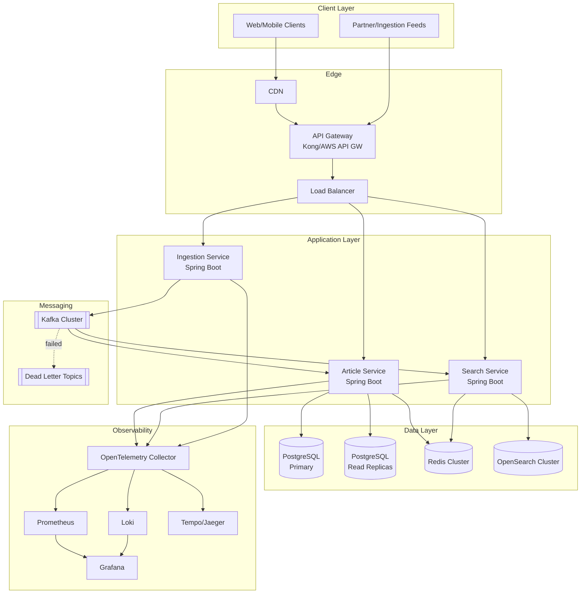
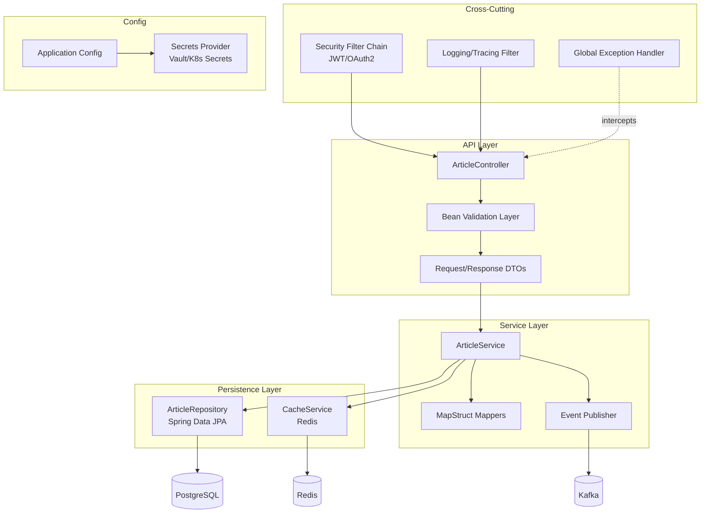
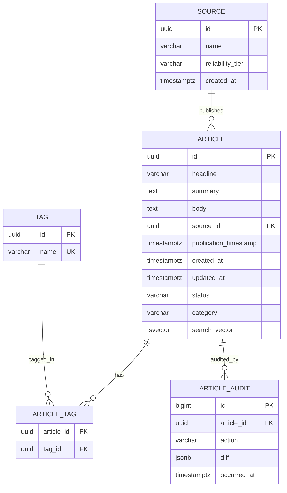

# Financial News Management Platform (FNMP) — Architecture Document

Stack: Java 21, Spring Boot 3.x, PostgreSQL 16, Redis, OpenSearch/Elasticsearch, Kafka, Kubernetes.

## 0. Assumptions (see full list in §17)
- Microservices-leaning modular monolith at launch, split later (see Trade-Offs).
- Single primary region, multi-AZ; multi-region is a Phase 9+ stretch goal.
- Cloud-agnostic Kubernetes deployment (works on AWS EKS / GCP GKE / on-prem).
- Auth: OAuth2/JWT via an external IdP (Keycloak self-hosted for portfolio, or Auth0/Cognito for prod).
- "1M articles/day" ≈ ~12 writes/sec average, with realistic bursts of 50-100 writes/sec around market open/close and major news events — this is the real design target, not the average.

---

## 1. High-Level Architecture



**Flow summary:** writes enter via the Ingestion Service, land on Kafka, get persisted to PostgreSQL (system of record) by the Article Service consumer, and are asynchronously projected into OpenSearch for search. Reads are served from Redis → PostgreSQL read replicas → OpenSearch for search queries specifically.

---

## 2. Low-Level Component Diagram (Article Service)



**Layer responsibilities:**
- **Controller**: HTTP concerns only — routing, status codes, no business logic.
- **DTO/Validation**: `jakarta.validation` annotations; request DTOs never equal entities (prevents over-posting).
- **Service**: transaction boundaries (`@Transactional`), business rules, orchestration.
- **Repository**: Spring Data JPA + custom `@Query`/Specification for dynamic search filters.
- **Exception Layer**: `@RestControllerAdvice` mapping domain exceptions → RFC 7807 `application/problem+json`.
- **Security Layer**: stateless JWT resource-server filter chain, method-level `@PreAuthorize`.
- **Config Layer**: `@ConfigurationProperties`, profile-based (`dev`, `staging`, `prod`), secrets injected via environment/Vault, never hardcoded.

---

## 3. Database Design

### 3.1 ER Diagram



### 3.2 Table Definitions (DDL excerpt)

```sql
CREATE TABLE source (
    id UUID PRIMARY KEY DEFAULT gen_random_uuid(),
    name VARCHAR(255) NOT NULL UNIQUE,
    reliability_tier VARCHAR(20) NOT NULL DEFAULT 'UNVERIFIED',
    created_at TIMESTAMPTZ NOT NULL DEFAULT now()
);

CREATE TABLE article (
    id UUID NOT NULL DEFAULT gen_random_uuid(),
    headline VARCHAR(512) NOT NULL,
    summary TEXT,
    body TEXT,
    source_id UUID NOT NULL REFERENCES source(id),
    publication_timestamp TIMESTAMPTZ NOT NULL,
    created_at TIMESTAMPTZ NOT NULL DEFAULT now(),
    updated_at TIMESTAMPTZ NOT NULL DEFAULT now(),
    status VARCHAR(20) NOT NULL DEFAULT 'PUBLISHED',
    category VARCHAR(50),
    search_vector TSVECTOR
        GENERATED ALWAYS AS (
            setweight(to_tsvector('english', coalesce(headline,'')), 'A') ||
            setweight(to_tsvector('english', coalesce(summary,'')), 'B')
        ) STORED,
    PRIMARY KEY (id, publication_timestamp)
) PARTITION BY RANGE (publication_timestamp);

-- Monthly partitions, e.g.:
CREATE TABLE article_y2026m07 PARTITION OF article
    FOR VALUES FROM ('2026-07-01') TO ('2026-08-01');

CREATE TABLE tag (
    id UUID PRIMARY KEY DEFAULT gen_random_uuid(),
    name VARCHAR(100) NOT NULL UNIQUE
);

CREATE TABLE article_tag (
    article_id UUID NOT NULL,
    tag_id UUID NOT NULL REFERENCES tag(id),
    PRIMARY KEY (article_id, tag_id)
);

CREATE TABLE article_audit (
    id BIGSERIAL PRIMARY KEY,
    article_id UUID NOT NULL,
    action VARCHAR(20) NOT NULL,
    diff JSONB,
    occurred_at TIMESTAMPTZ NOT NULL DEFAULT now()
);
```

### 3.3 Index Strategy
- Composite PK `(id, publication_timestamp)` — required because partition key must be part of every unique constraint.
- `CREATE INDEX idx_article_pubts ON article (publication_timestamp DESC);` — for time-ordered listing (created per-partition automatically).
- `CREATE INDEX idx_article_source ON article (source_id);`
- `CREATE INDEX idx_article_status ON article (status) WHERE status <> 'PUBLISHED';` — partial index for the small "non-published" subset.
- `CREATE INDEX idx_article_search_vector ON article USING GIN (search_vector);` — Postgres full-text fallback; primary search load goes to OpenSearch (see §5).
- `CREATE INDEX idx_article_headline_trgm ON article USING GIN (headline gin_trgm_ops);` — fuzzy/typo-tolerant fallback search.

### 3.4 Partitioning Strategy
- **Range partition on `publication_timestamp`, monthly**, matching query patterns (most reads/searches target recent news).
- Automated partition creation via `pg_partman` or a scheduled job, created 1-2 months ahead.
- Old partitions (>18 months) moved to cheaper storage tier or compressed/archived to object storage (S3/GCS) and detached — keeps hot partitions small and indexes fast.
- At 1M articles/day (~30M/month), each monthly partition is large but manageable; if row size or write hot-spotting becomes an issue, sub-partition by `source_id` hash within the month.

### 3.5 Migration Strategy
- **Flyway** (versioned SQL migrations), one migration per PR, never edited after merge.
- Naming: `V{timestamp}__{description}.sql`.
- Backward-compatible migrations only in the same deploy as app code (expand/contract pattern): add nullable column → deploy code that writes both → backfill → deploy code that reads new column → drop old column in a later release.
- Partition creation migrations are idempotent (`IF NOT EXISTS`).
- Every migration reviewed for lock duration; large backfills run in batches via a separate maintenance job, not inline in Flyway.

---

## 4. API Design

### 4.1 Versioning
- URI versioning: `/api/v1/...` — simplest to reason about, cache, and document; bump only on breaking change.

### 4.2 Endpoints

| Method | Path | Purpose |
|---|---|---|
| POST | `/api/v1/articles` | Create article |
| GET | `/api/v1/articles` | List (paginated, sortable, filterable) |
| GET | `/api/v1/articles/{id}` | Get by ID |
| GET | `/api/v1/articles/search?q=...` | Full-text/faceted search |
| DELETE | `/api/v1/articles/{id}` | Soft delete |
| GET | `/actuator/health` | Liveness/readiness |

### 4.3 Request/Response Examples

**Create — Request**
```json
{
  "headline": "Fed holds rates steady in July meeting",
  "summary": "The Federal Reserve kept interest rates unchanged...",
  "body": "...",
  "source": "Reuters",
  "publicationTimestamp": "2026-07-16T14:00:00Z",
  "category": "MONETARY_POLICY",
  "tags": ["fed", "interest-rates"]
}
```

**Create — Response (201)**
```json
{
  "id": "b3f1c2a4-...",
  "headline": "Fed holds rates steady in July meeting",
  "source": "Reuters",
  "publicationTimestamp": "2026-07-16T14:00:00Z",
  "createdAt": "2026-07-16T14:00:03Z",
  "status": "PUBLISHED"
}
```

**List — Response (200)**
```json
{
  "content": [ { "...": "article summary DTO" } ],
  "page": 0,
  "size": 20,
  "totalElements": 118342,
  "totalPages": 5917,
  "sort": "publicationTimestamp,desc"
}
```

**Error — Response (400/404/409/500) — RFC 7807**
```json
{
  "type": "https://fnmp.dev/errors/validation-error",
  "title": "Validation Failed",
  "status": 400,
  "detail": "headline must not be blank",
  "instance": "/api/v1/articles",
  "traceId": "9f8c1e2b7a3d4c5e"
}
```

### 4.4 Pagination, Sorting, Filtering
- Pagination: `page`, `size` (max 100, default 20), keyset/cursor pagination (`?after=<id>&pubAfter=<ts>`) offered for deep pagination to avoid `OFFSET` cost at scale.
- Sorting: `sort=publicationTimestamp,desc` (whitelist allowed fields to prevent injection/DoS via unindexed sorts).
- Filtering: `source`, `category`, `tag`, `dateFrom`, `dateTo` — translated to a JPA `Specification` for the DB path; free-text `q` routes to OpenSearch.

---

## 5. Scalability Strategy

- **Horizontal scaling**: stateless Spring Boot services behind the LB, scaled via Kubernetes HPA on CPU + custom Kafka-consumer-lag metric.
- **Database scaling**: single writer (PostgreSQL primary) + N async read replicas for GET/list/read-heavy traffic; connection pooling via PgBouncer to survive connection storms.
- **Read replicas**: `ArticleService` routes reads to replicas via a `@Transactional(readOnly = true)` routing datasource; writes always go to primary. Replication lag is monitored and read-your-writes is guaranteed for the writing request via a short-lived cache entry.
- **Caching**: Redis for (a) hot single-article lookups by ID, (b) first-page/most-recent-article list, (c) rate-limit counters. TTL-based with explicit invalidation on update/delete.
- **Queue-based ingestion**: `Ingestion Service` never writes directly to Postgres on the hot path — it validates, then publishes to Kafka (`article.created` topic), decoupling burst ingest rate from DB write throughput. Consumers batch-insert.
- **Search indexing**: Kafka consumer (`search-indexer`) projects article events into OpenSearch asynchronously (eventual consistency, typically sub-second lag); OpenSearch sharded by time-based index (`articles-2026.07`) with ILM/rollover.
- **Event-driven workflows**: downstream consumers (alerting, analytics, notification) subscribe to the same Kafka topics independently — no coupling to the Article Service's internals.
- At 1M/day sustained with 5-10x burst headroom, target: Kafka partitions ≥ 12 on the ingestion topic, Postgres writer sized for ≥200 batched inserts/sec, OpenSearch cluster sized for that same indexing rate plus query QPS.

---

## 6. Reliability Strategy

- **Retries**: Resilience4j `@Retry` with exponential backoff + jitter on Kafka publish and downstream HTTP calls; idempotency keys on `POST /articles` to make retries safe.
- **Circuit breakers**: Resilience4j `@CircuitBreaker` around OpenSearch calls (search degrades gracefully, see below) and any external partner API calls.
- **Dead Letter Queue**: Kafka consumers route poison messages (repeated deserialization/processing failure) to `*.DLQ` topics after N retries, with an alert and a replay tool.
- **Health checks**: Spring Boot Actuator `/health/liveness` and `/health/readiness`, wired to Kubernetes probes; readiness fails if DB or Kafka connectivity is down.
- **Graceful degradation**: if OpenSearch is down, `/search` falls back to PostgreSQL `tsvector` search (slower, reduced ranking, but functional) rather than failing the request.
- **Disaster recovery**: PostgreSQL PITR (WAL archiving) with RPO ≤5 min; automated daily base backups; documented RTO target (e.g., ≤1 hr) with a runbook; Kafka topics replicated (RF=3); cross-AZ deployment minimum, cross-region backup replication for DR.

---

## 7. Observability Strategy

- **Structured logging**: JSON logs via Logback + `logstash-logback-encoder`, every log line carries `traceId`, `spanId`, `userId` (if present), `service`, shipped to **Loki**.
- **Metrics**: Micrometer → **Prometheus** — request rate/latency/error (RED metrics) per endpoint, JVM metrics, Kafka consumer lag, DB pool utilization, cache hit ratio.
- **Tracing**: **OpenTelemetry** SDK auto-instrumentation, context propagated across HTTP → Kafka → DB spans, exported to Tempo/Jaeger.
- **Dashboards**: **Grafana** — service overview (RED), DB health, Kafka lag, cache hit rate, search latency — one dashboard per concern, not one giant dashboard.
- **Alerting**: Prometheus Alertmanager — error rate > threshold, p99 latency breach, consumer lag growing, replica lag, disk/connection pool saturation. Routed to Slack/PagerDuty with runbook links in the alert annotation.

---

## 8. Security Strategy

- **Secrets management**: HashiCorp Vault (or cloud KMS + K8s Secrets with encryption-at-rest); no secrets in source, env files, or images — enforced by CI scanning (see Developer Guide).
- **AuthN**: OAuth2/OIDC, JWT bearer tokens validated as a Spring Security resource server; short-lived access tokens + refresh tokens from an external IdP.
- **AuthZ**: role-based (`ADMIN`, `EDITOR`, `READER`) via method-level `@PreAuthorize`; write endpoints require `EDITOR`+, delete requires `ADMIN`.
- **Secure configuration**: profile-separated config, no prod secrets in `application.yml`, config validated at startup (fail fast on missing required secrets).
- **Dependency scanning**: OWASP Dependency-Check / Snyk in CI, fails build on high/critical CVEs.
- **Container scanning**: Trivy/Grype scan on every image build; base images pinned and patched on a schedule.
- **API protection**: rate limiting at the gateway (per API key/IP), request size limits, WAF rules for common injection patterns.
- **Input validation**: Bean Validation on every DTO, parameterized queries only (JPA does this by default — no string-concatenated SQL), output encoding on any rendered content.

---

## 9. Bottleneck & Failure Analysis

| Component | Bottleneck | Failure Scenario | Mitigation |
|---|---|---|---|
| PostgreSQL primary | Write throughput ceiling | Ingestion burst exceeds write capacity | Kafka buffers bursts; batch inserts; partition pruning keeps indexes small |
| PostgreSQL | Hot partition (current month) | All writes hit one partition | Monitor; sub-partition by hash if needed; autovacuum tuning |
| Redis | Cache stampede on popular article expiry | Thundering herd to DB on TTL expiry | Jittered TTLs, request coalescing/locking, stale-while-revalidate |
| Kafka | Consumer lag growth | Slow consumer can't keep up with producer rate | Autoscale consumers via lag-based HPA; DLQ for poison messages; increase partitions |
| OpenSearch | Indexing delay under burst | Search results lag behind writes (eventual consistency) | Accept documented lag SLA; degrade gracefully to PG full-text fallback |
| API Gateway/LB | Connection exhaustion under traffic spike | 5xx errors, timeouts | Autoscaling, connection pool tuning, rate limiting, circuit breakers |
| Read replicas | Replication lag | Stale reads after a write | Read-your-writes via short-lived cache; lag monitoring/alerting |
| Search Engine | Node loss / shard imbalance | Query latency spike or partial failure | Replica shards (≥1), cluster health monitoring, rolling restarts |

---

## 10. Trade-Off Analysis

| Decision | Alternatives | Why chosen | Trade-off accepted |
|---|---|---|---|
| PostgreSQL vs MongoDB | MongoDB | Article data is structured/relational (sources, tags, audit); ACID transactions matter for financial data integrity | Less flexible schema evolution than Mongo (mitigated by JSONB columns where needed) |
| Kafka vs RabbitMQ | RabbitMQ | Kafka's log-based retention supports replay, multiple independent consumers (search indexer, analytics, alerts), and much higher sustained throughput | Higher operational complexity than RabbitMQ |
| Elasticsearch/OpenSearch vs PG Full-Text Search | PG FTS only | Dedicated search engine gives relevance ranking, faceting, and scale headroom PG FTS can't match at this volume | Extra infra + eventual consistency between PG and search index |
| Redis vs local (in-JVM) cache | Caffeine/local cache | Multi-instance deployment needs a shared cache for consistency and to avoid N× DB load per replica | Network hop vs in-process; mitigated with a small local L1 cache layered in front where hot |
| Modular monolith vs microservices (at launch) | Full microservices from day 1 | Faster to build/demo for a portfolio project while keeping clean module boundaries (Article/Search/Ingestion as separate Spring modules) that map directly onto future service splits | Less "distributed systems" flash upfront, but avoids premature operational overhead; documented as an explicit future step |
| URI versioning vs header versioning | Header/media-type versioning | Simpler for consumers, easier to test/curl, better cache-ability | Less "elegant" REST purism |

---

## 11. Clarifying Questions & Documented Assumptions

Questions that would normally be asked of a stakeholder, answered here with explicit assumptions so the design can proceed:

1. **Monolith vs microservices?** → Assumed: modular monolith at launch (Article/Search/Ingestion as distinct modules), designed for clean extraction later.
2. **Cloud provider?** → Assumed: cloud-agnostic Kubernetes (works on AWS EKS, GCP GKE, or local kind/minikube for the portfolio demo).
3. **Auth requirements?** → Assumed: OAuth2/JWT, roles ADMIN/EDITOR/READER, external IdP (Keycloak for self-hosted demo).
4. **Budget?** → Assumed: portfolio-scale — most infra runs on free/low tiers or local docker-compose for demonstration, with notes on what changes at real production spend.
5. **Team size?** → Assumed: solo/small team; CI/CD and guardrails compensate for lack of large-team review bandwidth.
6. **Traffic pattern?** → Assumed: bursty around market hours/news events, ~12 writes/sec average with 5-10x bursts, read-heavy (search/browse >> writes).
7. **Search requirements?** → Assumed: full-text + filters/facets (source, category, date range, tags), typo tolerance.
8. **Multi-region?** → Assumed: out of scope for v1; single region multi-AZ; documented as a Phase 9+ extension.
9. **Compliance?** → Assumed: no regulated PII in scope (news content only); standard security best practices apply, no specific financial-industry certification targeted for the portfolio build.
10. **Portfolio vs production priority?** → Assumed: **portfolio-grade demonstrating production practices** — so depth of documentation, testing discipline, and CI/CD rigor matter as much as (or more than) raw infra scale.
