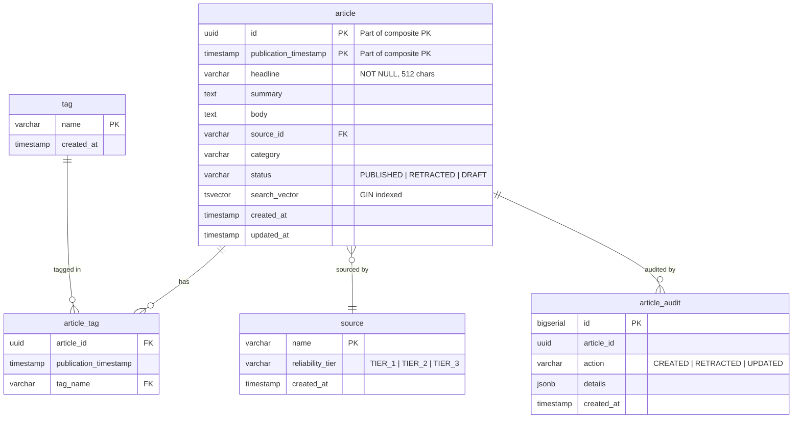

# Database ER Diagram

## Key Design Decisions

### Partitioning
`article` is range-partitioned by `publication_timestamp` monthly. Partitions are auto-created 4 months ahead.

### Composite Primary Key
Using `(id, publication_timestamp)` enables:
- Efficient time-range scans via partition pruning
- Cursor-based pagination using `(pub_ts, id)` tuples
- Unique identification without a separate sequence

### Full-Text Search
`search_vector` is a generated `tsvector` column combining headline, summary, and body with weighted ranks. The GIN index enables fast `plainto_tsquery` lookups as a fallback when OpenSearch is unavailable.

### Soft Delete
Articles are marked as `RETRACTED` rather than deleted. A partial index (`WHERE status != 'RETRACTED'`) optimizes active queries.
